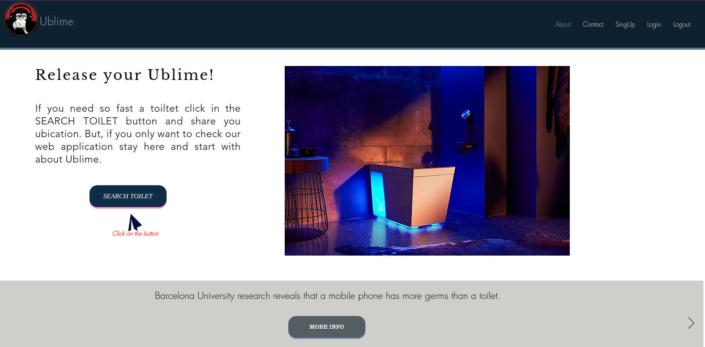
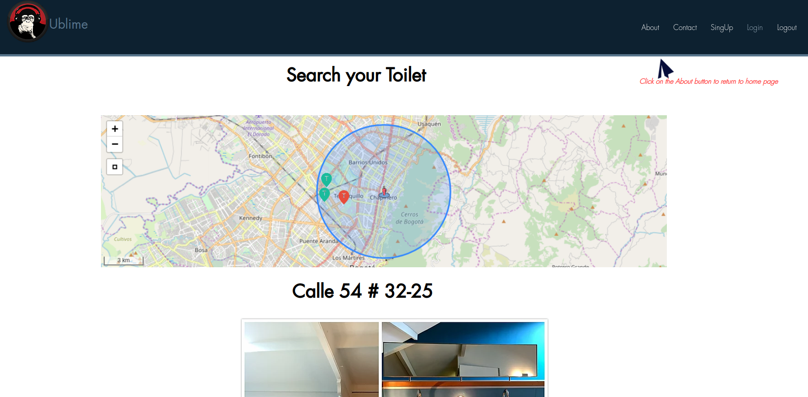
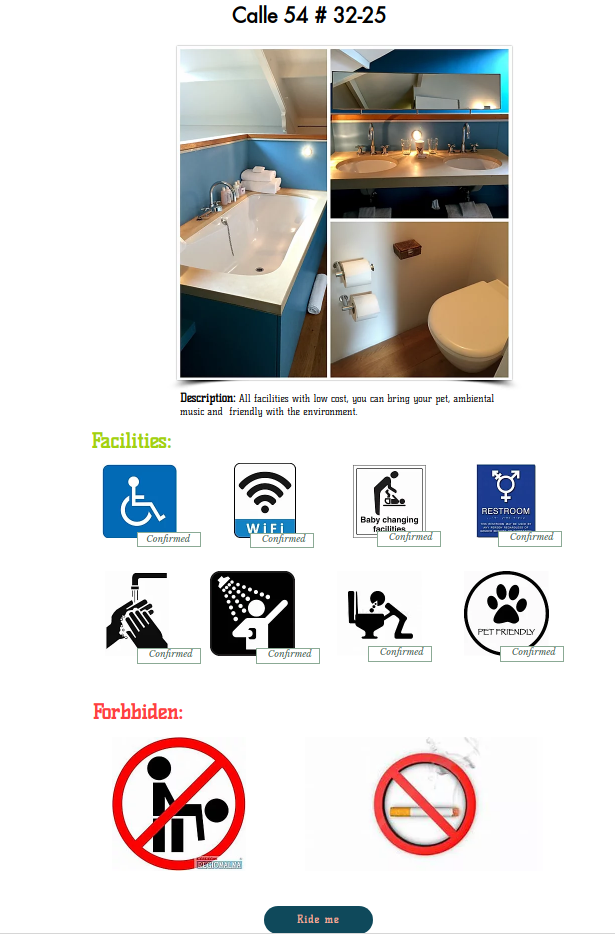

  
  
  

:colombia:<b>**********UBLIME**********</b>

  
  
**********click on the image for a video demonstration**********

 

## Introduccion
Ublime is an application web that help you when you have physiological emergency, so easy to use. Share your geoposition, Ublime search for you three near restroom/toilets and finally start your path.
 

## Check Ublime blogs
Sebastian and Yesid wrote some interesting experiences during Ublime develop, if you feel curios check their blogs
|             Blog               |             Author                  |
|--------------------------------| ---------------------------------------- |
|**https://medium.com/@948/my-experience-building-ublime-app-5a2ee6d21725**| by Sebastian Montealegre|
|**https://medium.com/@944/ublime-web-application-280929825a3d**| by Yesid Gutierrez|
 

## Installation/Use
you don't need install anything, only type the web page and start the experience https://ublime.herokuapp.com/

<b>**********Quick Guide**********</b>

  

**********Share your position**********

 

  

**********Choice one of the Three, shows in the map**********

 

  

*******check facilities/forbbiden anr click on Ride me button. You don't need more, It's all, so easy*******

 
 

## Roles
- Provider: If you have a restroom/toilet to give service, you can register like a provider
- User: You don't need to register.
 

## Contributing

|             Name               |             GitHub                  |             LinkedIn                |
|--------------------------------| ------------------------------------|-------------------------------------|
|**Juan Sebastian Montealegre**| https://github.com/SebastianCalle|https://www.linkedin.com/in/juan-sebastian-calle/
|**Yesid Gutierrez**|https://github.com/Yesidh|https://www.linkedin.com/in/yesid-gutierrez-9577a5b3/|
 

## Build With
- Python: Backend language
- django/leaflet: Web development Framework
- Postgres/Postgis - Database
- Bootstrap - Frontend
- JavaScript - Frontend
 

## Future
Create own restrooms for Ublime
 

## Licensing
This project is licensed under the MIT License
